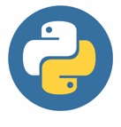
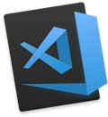
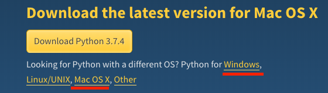
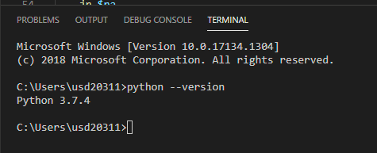
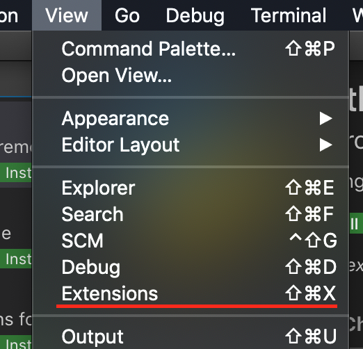
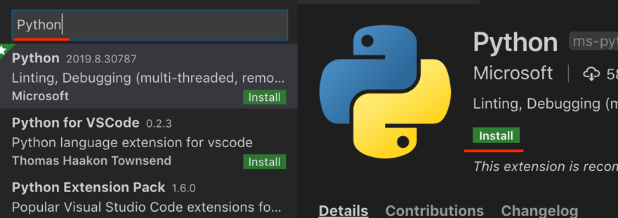

# Install Python 3 for VSCode

<!--
10/03/2020 Reviewed by Kim Nguyen
-->

> Last updated on Oct 3, 2020, by Kim Nguyen  
> Center for Information Assurance (CIAE) @ City University of Seattle (CityU)

<p align="center">
&emsp;&emsp;&emsp;

</p>

## Before You Start

* The directory path shown in screenshots may be different from yours.
* Some steps are not explained in the tutorial.  If you are not sure what to do:
  1. Consult the resources listed below.  
  2. If you cannot solve the problem after a few tries, ask a TA for help.

## Learning Outcomes

Students will be able to:

* Setup the working environment for Python

## Resources

Matthes, E. (2019). [Python Crash Course: A Hands-On, Project-Based Introduction to Programming, 2nd Edition](https://login.proxy.cityu.edu/sso/skillport?context=146803). No Starch Press. (ISBN 9781593279288)

---

* [Install Python in your machine](#install-python-in-your-machine)

---

# Install Python in your machine

We will use Python 3. If you have already installed Python3, please skip this section. If you have Python 2, please upgrade to Python 3.

 1. Click the following link to visit Python downloading page <https://www.python.org/downloads/>

    Under the Downloads dropdown list, select the OS

 2. Click the downloading link based on the operational system you are using:

    

    Note: While creating this document the version was 3.7.4, you might see an advanced version. Download the latest version.

 3. Perform the installation process:

    Click on **Download Python 3.7.4** (you might see a different version). If you are using Windows, `.exe` file will get downloaded. If you are using Mac, `.pkg` file will get downloaded. After the downloading the files, follow the instructions on your screen to install python.

 4. After the installation, Open Visual Studio Code. Then, open the terminal from the VSCode by hitting the `control` + `~` key. Type the following command to test Python version:

    ```shell
    $ python3 --version
    ```

    

    Note: you are supported to see the python version (It may be slightly different from the version shown here. But it should be 3.x.x).

 5. The python extension is also recommended to install in the VS Code.

    Click the View -> Extension in the VS Code menu

    

    Search python and click the install button on the right

    
